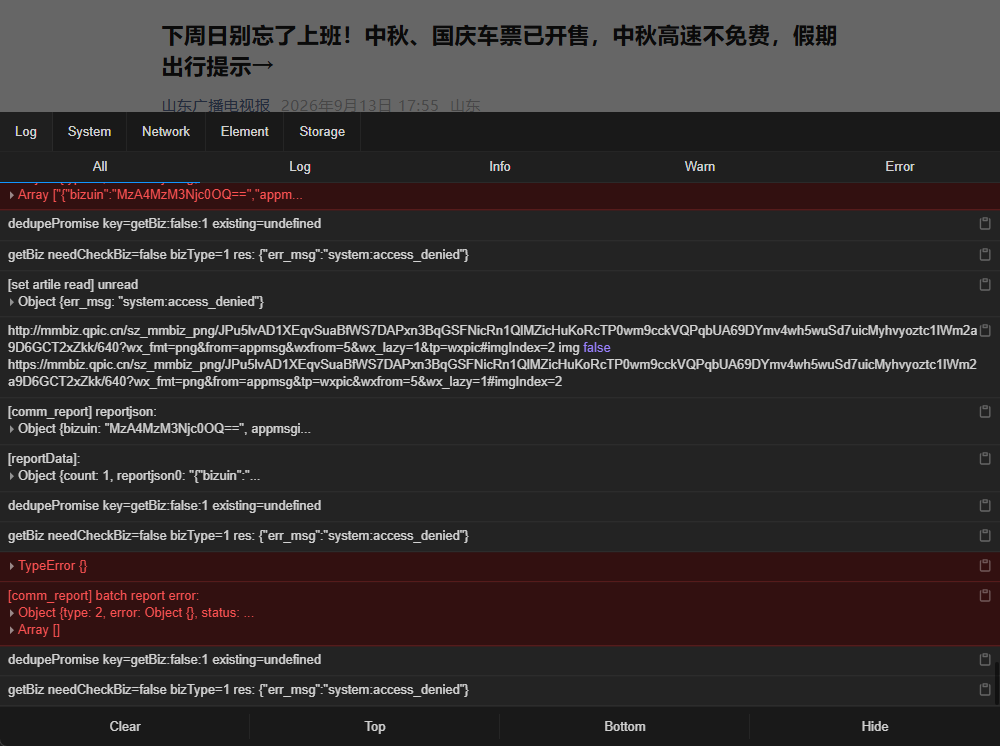

<div align="center">


# WeChat-H5-DevTools

**WMPFDebugger 内置浏览器与公众号 H5 满血调试与逆向工具箱**

[](https://www.python.org/)
[](https://nodejs.org/)
[](https://opensource.org/licenses/MIT)
[](https://frida.re/)
[](https://github.com/)

[核心功能](#features) · [实测效果](#screenshots) · [快速上手](#quickstart) · [图形界面](#gui) · [命令行指南](#cli) · [实战工作流](#workflows) · [兼容矩阵](#matrix) · [常见问题](#faq) · [开源鸣谢](#attribution) · [赞助支持](#sponsor) · [交流群](#community) · [免责声明](#disclaimer)

</div>

---

<a id="background"></a><a id="项目背景"></a>
## 📖 项目背景

在微信 4.x（Windows / macOS）架构升级后，官方彻底屏蔽了内置浏览器窗口对物理 `F12` 热键的响应，同时外部脱机浏览器调试常常受阻于 **“请在微信客户端打开链接”**、`WeixinJSBridge` 缺失、异步 Webpack Chunk 分包难以提取等难题。

**`WeChat-H5-DevTools`** 是一套开箱即用的工业级全能解决方案，集 **微信内免按键浮动调试器注入**、**脱机高保真 JSSDK 模拟沙箱**、**本地代码实时热重载 (Local Overrides)**、**自动化全量 AST 语法树深度解混淆与 Webpack 模块解包** 以及 **全域 API 路由与国密算法静态审计** 于一体，全面赋能微信 Web 生态开发与安全审计！

---

<a id="matrix"></a><a id="兼容矩阵"></a><a id="版本与内核兼容矩阵"></a><a id="微信版本与内核兼容矩阵"></a>
## 🖥️ 微信版本与 RadiumWMPF 内核兼容矩阵 (Compatibility Matrix)

为了方便非专业开发者与安全研究人员一目了然，下表列出了工具对微信全系列主流版本、**`RadiumWMPF` 内核版本**架构及核心进程的深度适配支持情况：

| 微信客户端大版本 | 典型测试验证版本 | RadiumWMPF 内核版本 (Kernel) | 渲染/Web 核心进程名 | 调试注入机制 | 兼容状态 |
| :--- | :--- | :--- | :--- | :--- | :--- |
| **微信 4.1.x 最新版**<br>*(当前主推)* | **`4.1.13.12`**<br>`4.1.12.26`<br>`4.1.5.30` | **`25560`** / **`25510`** / `25497` / `25364` / `20089` | `WeixinExt.exe`<br>`Weixin.exe` (`--type=renderer`) | Frida 动态拦截 `CreateProcessW` 挂载注入<br>+ 透明代理无感注入 `vConsole` | `[PASS]` 满血完美支持 |
| **微信 4.0.x 系列**<br>*(重构初期)* | `4.0.2`<br>`4.0.1`<br>`4.0.0` | **`16389` / `16203` / `16133` / `14315`**<br>*(Blink 深度重构版架构)* | `Weixin.exe`<br>`WeChatAppEx.exe` | 进程自适应探测与多点命令行注头 | `[PASS]` 满血完美支持 |
| **微信 3.9.x 经典版**<br>*(长期支持)* | `3.9.12`<br>`3.9.11`<br>`3.9.10` 及旧版 | **`11581` ~ `13909`**<br>*(经典 XWeb / Chromium 85~108)* | `WeChat.exe`<br>`WeChatAppEx.exe` | 经典 `--xweb-enable-inspect=1` 参数注入通道 | `[PASS]` 满血完美支持 |
| **外部脱机沙箱**<br>*(免微信客户端)* | 任意操作系统<br>(Win / Mac / Linux) | **Edge / Chrome 最新版**<br>*(Chromium 130+ 满血原生引擎)* | `msedge.exe`<br>`chrome.exe` | `document_start` 毫秒级注入 30+ WeixinJSBridge Mock | `[PASS]` 满血原生 F12 |

> **💡 如何查看本机的 RadiumWMPF 内核版本？**
> 1. 按快捷键 `Win + R` 打开运行窗口，粘贴并回车：
>    ```text
>    %AppData%\Tencent\xwechat\XPlugin\Plugins\RadiumWMPF
>    ```
> 2. 打开后看到的以纯数字命名的文件夹（如 `25510`、`17127`、`16389` 等），该数字即为本机微信当前正在生效使用的 **RadiumWMPF 内核版本号**！
> 3. 工具内置了 `WeChatFinder` 与多源版本探测器，全自动适配上述所有版本，无需手动配置偏移。

---

<a id="quickstart"></a><a id="快速上手"></a><a id="新手起步"></a><a id="小白新手三步起飞"></a>
## 💡 小白新手三步起飞指引（不用懂 AI，不用懂代码！）

如果你不熟悉 AI 或复杂的技术术语，只需跟随以下 3 步，像使用普通软件一样直接上手：

### 第一步：打开终端安装（只需执行一次）
按键盘 `Win + R`，输入 `cmd` 或 `powershell` 回车，粘贴运行：
```bash
git clone https://github.com/xuange520/WeChat-H5-DevTools.git
cd WeChat-H5-DevTools
pip install -r requirements.txt
pip install -e .
```
*（执行完毕后，你电脑里的任何目录都可以直接使用 `wx-h5` 命令了！）*

### 第二步：按你的实际需求，直接复制一行命令使用！

* **需求 A：我想在电脑微信里面直接看报错日志、抓包看数据？**
  * 在命令行输入：
    ```bash
    wx-h5 proxy
    ```
  * 打开微信里的任意公众号网页，右下角就会自动出现**绿色的 vConsole 调试小球**，点开就能查看 Log、Network 抓包、Storage 缓存！

* **需求 B：网页提示“请在微信客户端打开”，我想在电脑自带 Edge/Chrome 里按 F12 调试？**
  * 在命令行输入（把链接换成你的网页）：
    ```bash
    wx-h5 open "https://你的公众号网页链接.com"
    ```
  * 电脑会自动弹出一个满血 Edge/Chrome 浏览器，自带完整 F12 开发者工具，并且网页会误以为你是在真实的微信手机端中打开，绝不报错！

* **需求 C：我想把混淆压缩的 JS 代码（一堆看不懂的 a, b, c 变量）还原成清晰好懂的代码？**
  * 在命令行输入：
    ```bash
    wx-h5 deobfuscate "你的代码文件夹路径"
    ```
  * 工具会自动执行 AST 逆向解混淆，并把 Webpack 打包的大文件彻底拆分成各个独立的业务模块！

* **需求 D：我想一键查出这个系统用了什么后端 API 接口、域名、国密加密算法？**
  * 在命令行输入：
    ```bash
    wx-h5 scan "你的代码文件夹路径" -e 审计报告.md
    ```
  * 几秒钟后，就会在当前目录下生成一份排版精美、包含了所有接口与加密特征的完整报告文件！

* **需求 E：我不喜欢黑框命令行，我想直接使用高颜值可视化桌面客户端？**
  * 在命令行输入：
    ```bash
    python examples/supabase_gui/app.py
    ```
  * 电脑将自动弹出 Fluent 风格桌面客户端，支持一键启动代理、AST 解混淆、实时中继日志与一键复制全部日志！

---

<a id="screenshots"></a><a id="实测效果"></a><a id="实战效果"></a>
## 📷 微信内置推文实盘调试效果展示 (Live Screenshots)

基于最新微信客户端（`4.1.13.12`）与 `RadiumWMPF` 内核实测，无需逆向修改微信二进制，公众号推文与 H5 页面无感注入：

<div align="center">

| 微信公众号推文右下角常驻绿色 vConsole 按钮 | 点击绿色按钮即刻展开移动端完整控制台 |
| :---: | :---: |
|  |  |
| *图 1：微信内置浏览器打开任意推文，右下角自动浮现 vConsole 绿标* | *图 2：点击绿标即刻展开 Console、Network 抓包、Storage 与 DOM 树* |

</div>

---

<a id="features"></a><a id="核心功能"></a><a id="核心功能全景"></a>
## ✨ 核心功能全景

* **微信 4.x 内置浏览器 DevTools 强开**：基于 Frida 17+ 进程级挂载，自适应适配微信 3.x / 4.x 多架构（全面覆盖最新的 `4.1.13.12`），一键解锁渲染器调试通道；
* **无感透明代理注入 vConsole**：内置轻量本地代理网关，自动向所有访问的 H5 网页注入 `vConsole` / `Eruda` 移动端浮动控制台，彻底无视客户端热键屏蔽；
* **本地代码实时热重载 (Local Overrides)**：开发调试神器，支持本地单文件秒级替换线上 JS/CSS，自动禁用缓存与跨域放行，修改即时生效；
* **脱机高保真沙箱与 JSSDK 模拟**：内置全平台微信 User-Agent 矩阵与 30+ 常见 `WeixinJSBridge` 原生 API Mock（支持支付、扫码、定位、分享拦截），外部 Chrome/Edge 满血开 F12 不报错；
* **全站 Webpack 分包递归逆向提取**：输入任意公众号 H5 链接，自动递归提取主包、异步 Chunk JS、CSS 及静态资产，按原始路径组织落盘；
* **自动化 AST 深度解混淆与模块解包**：内置工业级 AST 语法树还原引擎，支持 Webpack 打包模块解压，集成微信小程序组件 AST 容错外科手术，自动切除私有组件元数据与悬空闭包，零告警高保真还原；
* **SourceMap 一键还原 `.vue` / `.ts` 原始工程**：自动探测并解包 SourceMap，将编译混淆的代码 1:1 还原为原始的 Vue 单文件组件与 TypeScript 源码；
* **全域 API 路由与密码学安全审计**：离线静态审计已提取的 JS 代码，深度提取后端业务域名 (Base URLs)、微信原生网络库 (`wx.request`, `@haici/request-core`)、国密算法 (`miniprogram-sm-crypto`, `@haici/gmsm4`, `TripleDES`)、非对称加密 (RSA/`jsbn`)、防篡改签名机制与全量业务 API 路由清单。

---

<a id="gui"></a><a id="图形界面"></a><a id="gui启动指南"></a>
## 🖥️ 图形交互界面 (GUI) 启动指南

除了命令行 CLI 工具外，本项目提供了两种交互友好的桌面可视化客户端，满足不同操作偏好：

### 1. 现代 Fluent WebGUI (强烈推荐 / 基于 WebView2 硬件加速)
采用微软 Fluent Design / Supabase 现代暗黑极简卡片视觉规范，内置多标签页路由：
- **实时运行日志**：集成终端日志双向中继流，提供 **`[复制全部日志]`**、**`[打开本地日志]`**、**`[定位日志目录]`** 一键物理操作；
- **全日志物理落盘**：日志实时安全同步存盘至本地 `records/logs/console_stream.log`；
- **可视化调试与反混淆**：一键拉起透明代理注入、AST 深度解混淆与模块解包；
- **内置合规与开源鸣谢**：直接内置开源依赖仓库链接、防倒卖免责声明与 FAQ 排障。

**启动命令**：
```bash
python examples/supabase_gui/app.py
```
> *环境要求：Windows 10/11（Windows 11 自带 WebView2；Win10 用户需确保已安装 Microsoft Edge WebView2 运行时）。*

### 2. PyQt6 Fluent 传统桌面版
针对传统桌面应用开发者的原生 Qt6 界面，支持深色/浅色主题自适应与标准 Fluent 组件。

**启动命令**：
```bash
# 方式 A：通过 CLI 快捷子命令启动
wx-h5 gui

# 方式 B：直接运行模块入口
python -m wechat_h5_devtools.gui.main_window
```
> *依赖安装：需先执行 `pip install PyQt6 PyQt-Fluent-Widgets pywebview` 安装界面拓展组件。*

---

<a id="cli"></a><a id="命令行指南"></a><a id="命令行操作指南"></a>
## 💻 命令行操作指南

你可以通过全局别名 `wx-h5 <命令>` 或 `python main.py <命令>` 进行调用。

### 核心命令与参数索引表

| 命令 | 核心功能 | 核心参数与选项 | 典型调用范例 |
| :--- | :--- | :--- | :--- |
| `doctor` | 本地微信、浏览器与 Frida 环境诊断 | 无 | `wx-h5 doctor` |
| `hook` | 微信客户端进程级 DevTools 参数注入 | `--path, -p` (指定微信主程序路径) | `wx-h5 hook` |
| `proxy` | 启动 vConsole 移动端透明代理网关 | `--port, -p` (默认 8899), `--override-dir, -d` | `wx-h5 proxy --port 8899 -d ./local_js` |
| `override` | 【开发神器】本地代码实时替换与热重载 | `<override_dir>`, `--port, -p` | `wx-h5 override ./local_js --port 8899` |
| `open` | 外部独立沙箱拉起满血 F12 (免微信) | `<url>`, `--browser, -b`, `--ua, -u` | `wx-h5 open "https://..." --ua ios` |
| `dump` | 全站 Webpack 异步分包递归抓取 | `<url>`, `-o` (输出目录), `-d` (抓取后自动解混淆) | `wx-h5 dump "https://..." -o ./site -d` |
| `deobfuscate` | 批量 AST 语法树解混淆与模块解包 | `<target_dir>`, `-o` (输出目录), `-a / --all` (批量子工程) | `wx-h5 deobfuscate ./site -a` |
| `restore` | 从 SourceMap 逆向还原 Vue/TS 源码 | `<target_dir>`, `-o` (输出目录) | `wx-h5 restore ./site` |
| `scan` | 静态审计提取域名、API、国密与凭据 | `<target_dir>`, `-e` (导出MD报告), `-a / --all` | `wx-h5 scan ./site -e report.md` |

---

<a id="workflows"></a><a id="实战工作流"></a><a id="实战场景"></a>
## 🎯 四大经典实战工作流

### 场景 1：在微信客户端内部直接唤出调试器 (vConsole 浮动绿标)
*适用场景：需要在真实微信登录态、支付环境或企业微信内部调试页面。*

1. **启动透明代理网关**：
   ```bash
   wx-h5 proxy --port 8899
   ```
2. **配置微信或系统代理**：
   将系统代理或网络抓包工具的上游代理设置为 `127.0.0.1:8899`。
3. **打开任意公众号网页**：
   页面右下角将自动浮现绿色 `vConsole` 按钮，点击即可实时查看 Console 日志、Network 抓包、Storage 缓存与 Elements DOM 树！

<div align="center">

| 微信公众号推文右下角常驻绿色 vConsole 按钮 | 点击绿色按钮即刻展开移动端完整控制台 |
| :---: | :---: |
|  |  |

</div>

---

### 场景 2：【开发神器】本地代码实时映射替换与热重载 (Local Overrides)
*适用场景：线上 H5 出了 Bug，想在本地修改某个 JS/CSS 文件并立即在微信或浏览器中查看实际效果，无需繁琐重新打包上线。*

1. **准备本地修改后的 JS 文件**（例如 `D:/debug_js/chunk-common.js`）；
2. **启动 Local Overrides 拦截服务**：
   ```bash
   wx-h5 override D:/debug_js --port 8899
   ```
3. **刷新网页**：
   当网页请求该脚本时，代理网关将自动命中并**以本地文件秒级替换返回**（自动禁用缓存并放行跨域），修改本地代码立即生效！

---

### 场景 3：脱离微信，在 Chrome / Edge 原生 F12 中畅快调试
*适用场景：微信内无法按 F12，想在电脑原生浏览器中打断点、抓包、修改 CSS，且不被“请在微信客户端打开”拦截。*

```bash
# 模拟 iPhone 微信环境并在 Edge 中打开
wx-h5 open "https://mp.weixin.qq.com/s/xxxx" --browser edge --ua ios

# 模拟 Android 微信环境并在 Chrome 中打开
wx-h5 open "https://mp.weixin.qq.com/s/xxxx" --browser chrome --ua android
```
工具会在浏览器启动瞬间（`document_start` 第 0 毫秒）自动注入包含 30+ 原生 API 的 `WeixinJSBridge` 与 `JSSDK` 挡板，目标页面直接判定为纯正微信环境，右侧自动展开满血 DevTools 开发者工具！

---

### 场景 4：批量 AST 解混淆与全域静态逆向代码审计
*适用场景：面对混淆压缩的 JS 代码或小程序单体包，恢复其模块结构并提取后端接口清单与加密算法。*

```bash
# 1. 批量解混淆某个总目录下的所有子版本/子小程序工程
wx-h5 deobfuscate "./output/wx1363195c4fb75cfc" --all

# 2. 执行静态扫描并导出高质感 Markdown 审计报告
wx-h5 scan "./output/wx1363195c4fb75cfc/344_deobfuscated" --export audit_report.md
```

**扫描报告涵盖**：
* **后端业务域名 (Base URLs)**：提取硬编码的业务 API 接口域名；
* **网络请求框架**：识别 `wx.request`, `uni.request`, `@haici/request-core`, `axios` 等；
* **密码学与加密特征**：识别国密 SM2/SM3/SM4、TripleDES、AES、RSA/jsbn、HMAC-SHA256、JWT/jtoken、时间戳防重放签名；
* **凭据与敏感字段**：识别微信 AppID、插件依赖 ID、业务 Token 与请求头；
* **业务 API 清单**：提纯去重全量 RESTful 与 RPC 路由接口。


---

<a id="faq"></a><a id="常见问题"></a>
## ❓ 常见问题精选与排障索引 (FAQ)

为了保持主页文档精炼，涵盖内核脱钩机制、多进程沙箱识别、强缓存粉碎、Node 堆扩容与提权等全量 11 大核心疑难方案，已统一收拢归档至独立技术全书：

👉 **[点击查阅完整技术全书：常见问题排障全书 (FAQ.md)](./docs/FAQ.md)**

### 高频速查 TOP 3：

<details>
<summary><strong>Q1: 运行 <code>wx-h5</code> 提示“无法识别为 cmdlet 或命令”？</strong></summary>

> **解答**：请在项目根目录运行 `pip install -r requirements.txt` 和 `pip install -e .`，或直接使用 `python main.py <命令>` 执行。详见 [FAQ.md: Q1](./docs/FAQ.md#q1-运行-wx-h5-提示无法识别为-cmdlet-或命令)。
</details>

<details>
<summary><strong>Q2: 执行 <code>wx-h5 hook</code> 提示“已有微信进程在运行”？</strong></summary>

> **解答**：微信在开启状态下无法注入调试参数。请彻底退出系统托盘微信，或在终端运行 `taskkill /F /IM WeChat.exe /IM Weixin.exe /IM WeChatAppEx.exe /T` 后重试。详见 [FAQ.md: Q2](./docs/FAQ.md#q2-执行-wx-h5-hook-提示已有微信进程在运行)。
</details>

<details>
<summary><strong>Q3: 外部脱机浏览器打开仍提示“请在微信客户端打开”？</strong></summary>

> **解答**：使用 `wx-h5 open "<URL>" --browser edge --ua ios` 启动，工具会在 `document_start` 毫秒级自动注入包含 30+ 接口的 `WeixinJSBridge` 模拟沙箱。详见 [FAQ.md: Q3](./docs/FAQ.md#q3-外部脱机浏览器打开仍提示请在微信客户端打开或特定-jssdk-接口未响应)。
</details>

> 📘 **更多疑难排障（代理端口抢占、Node 8GB 堆内存溢出、CDN 403 跨域、UAC 权限提权、GUI 启动异常等）**：请直接移步至 [docs/FAQ.md](./docs/FAQ.md) 查阅完整解答。

---

<a id="sponsor"></a><a id="赞助与支持"></a><a id="赞助支持"></a>
## ☕ 赞助与支持 (Sponsor)

开源不易，长效维护更需投入大量精力。

本项目由作者基于业余时间深度逆向研发，持续追踪跟进微信客户端（如最新的 `4.1.13.12`）与 **RadiumWMPF 内核**底层渲染架构的变动，并持续维护适配各版本内核。

如果您觉得 **`WeChat-H5-DevTools`** 在您的日常开发、线上应急调试、逆向分析或安全审计工作中切实帮助到了您、为您节省了宝贵的时间，**欢迎请作者喝一杯香浓的咖啡以表支持与鼓励！☕** 您的慷慨支持是本项目长期迭代、技术突破与生态完善的最大动力！

<div align="center">

|  |  |
| :---: | :---: |
| 支付宝 | 微信支付 |

</div>

> **💡 赞助权益**：
> 
> 1. 赞助者提出的特定微信版本 / RadiumWMPF 内核适配 Issue 与定制需求将享受**第一优先级优先响应与攻坚**；
> 2. 赞助名单将被永久收录至仓库主页的 `🌟 鸣谢赞助榜 (Backers & Sponsors)` 予以致谢；
> 3. 扫码赞助时欢迎在备注中留下您的 **【GitHub ID / 昵称 / 寄语】**，或通过微信 `Sleep_Plan` 告知。

---

<a id="community"></a><a id="交流群"></a><a id="官方交流群"></a>
## 💬 官方技术交流群 (Community)

欢迎加入 **WeChat-H5-DevTools 官方技术交流群**，与广大逆向安全研究人员、Web 前端工程师及内核适配者共同交流技术、反馈新版微信与 RadiumWMPF 内核 Issue、探讨高阶实战玩法！

<div align="center">


<br>

> **💡 入群提示**：微信扫码即可直接加入官方交流群。若遇二维码过期，请直接添加作者微信 **`Sleep_Plan`**（备注：**DevTools 入群**），由作者拉入官方群聊。

</div>

---

<a id="author"></a><a id="作者与联系方式"></a>
## 👤 作者与联系方式

- **作者 / 核心开发者**：**xuange520**
- **官方微信 (推荐首选)**：`Sleep_Plan` (微信逆向交流 / 商务合作 / 疑难排障)
- **官方邮箱**：`2603066228@qq.com` / `xuangeylw@gmail.com`
- **GitHub 主页**：[@xuange520](https://github.com/xuange520)
- **项目开源仓库**：[WeChat-H5-DevTools](https://github.com/xuange520/WeChat-H5-DevTools)

---

<a id="attribution"></a><a id="开源鸣谢"></a><a id="开源引用与技术借鉴"></a>
## 🙏 开源引用、技术借鉴与鸣谢 (Attribution & Acknowledgements)

本项目遵循开源社区技术诚信准则（Academic & Technical Integrity）。在研发攻坚过程中，深度借鉴、引用并受启发于以下优秀的开源项目与社区先驱成果，特此致以最崇高的敬意：

### 1. 核心底层依赖与直接调用组件

| 开源项目 | 官方仓库地址 (GitHub) | 开源许可证 | 本项目核心作用与应用场景 |
| :--- | :--- | :--- | :--- |
| **Frida** | [frida/frida](https://github.com/frida/frida) | wxWindows | 全平台动态代码插桩框架，用于注入 Windows 微信主进程 `CreateProcessW` 与 Chromium 渲染沙箱 |
| **vConsole** | [Tencent/vConsole](https://github.com/Tencent/vConsole) | MIT | 腾讯官方前端移动端调试面板，用于在微信内置浏览器页面中免快捷键注入浮动调试球 |
| **Eruda** | [liriliri/eruda](https://github.com/liriliri/eruda) | MIT | 移动端多功能控制台，提供 Elements 节点树审查、Network 抓包拦截与 Storage 本地存储查看 |
| **AST 解混淆与解包引擎** | [j4k0xb/webcrack](https://github.com/j4k0xb/webcrack) | MIT | JavaScript 深度 AST 反混淆、常量折叠与 Webpack 单体包拆解还原底层引擎 |
| **Mitmproxy** | [mitmproxy/mitmproxy](https://github.com/mitmproxy/mitmproxy) | MIT | 支持 TLS 拦截与 HTTP/HTTPS 流量实时重写的交互式网络代理中间件 |
| **Babel** | [babel/babel](https://github.com/babel/babel) | MIT | JavaScript 抽象语法树（AST）解析、遍历与代码重构核心基石 |
| **PyWebView** | [r0x0r/pywebview](https://github.com/r0x0r/pywebview) | BSD-3-Clause | 跨平台轻量级桌面 GUI 容器，原生调用 Windows 10/11 WebView2 硬件加速引擎 |
| **Click** | [pallets/click](https://github.com/pallets/click) | BSD-3-Clause | 优雅、强大的 Python 交互式命令行 CLI 工具链框架 |
| **Rich** | [Textualize/rich](https://github.com/Textualize/rich) | MIT | 终端高质感彩色文本排版、表格与加载进度条渲染组件 |
| **PyQt-Fluent-Widgets** | [zhiyiYo/PyQt-Fluent-Widgets](https://github.com/zhiyiYo/PyQt-Fluent-Widgets) | GPLv3 | Windows 11 Fluent Design 风格桌面控件库灵感与参考 |

### 2. 微信逆向生态研究与架构借鉴项目

| 参考项目 | 作者 / 组织 | 官方仓库地址 (GitHub) | 核心借鉴价值与灵感启发 |
| :--- | :--- | :--- | :--- |
| **WeChatOpenDevTools-Python** | JaveleyQAQ | [JaveleyQAQ/WeChatOpenDevTools-Python](https://github.com/JaveleyQAQ/WeChatOpenDevTools-Python) | 微信内置浏览器与小程序开启 DevTools 开发者工具的核心思路与历史特征码参考 |
| **First** | notstarr | [notstarr/First](https://github.com/notstarr/First) | 微信小程序全功能调试工具箱，启发了 Frida 动态挂钩 + CDP 协议与 MCP 工具链的设计 |
| **e0e1-wx** | eeeeeeeeee-code | [eeeeeeeeee-code/e0e1-wx](https://github.com/eeeeeeeeee-code/e0e1-wx) | 微信小程序反编译、资源提取与工程结构还原工作流参考 |
| **WeChat-Hook** | aixed | [aixed/WeChat-Hook](https://github.com/aixed/WeChat-Hook) | Windows 微信底层 Hook 机制与协议通信分析参考 |
| **wechat-windows-versions** | tom-snow | [tom-snow/wechat-windows-versions](https://github.com/tom-snow/wechat-windows-versions) | 微信 Windows 历史全版本客户端版本归档与 RadiumWMPF 内核演进路线参考 |

---

<a id="disclaimer"></a><a id="免责声明"></a>
## ⚠️ 免责声明 (Disclaimer)

1. **合法合规与技术研究**：本项目（`WeChat-H5-DevTools`）仅用于网络安全研究、前端跨平台兼容性测试、Web 开发调试与技术学习交流，严禁将其用于任何侵犯他人合法权益、危害网络安全或违反相关法律法规的活动。
2. **风险自负原则**：使用者在基于本项目进行调试、抓包或接口调用时，须自行确保行为的合法合规性。任何因不当使用、恶意滥用或二次开发所引发的法律纠纷、系统故障、财产损失或账号风险，本项目作者及贡献者概不承担任何直接或连带法律责任。
3. **知识产权尊重**：本项目中涉及的第三方商标、技术协议及相关标识，其知识产权均归其合法所有者所有。若相关方认为本项目存在侵权疑虑，请通过 Issue 与作者联系，我们将依法核实并积极配合处理。
4. **防倒卖与非商业性声明 (Anti-Resale & Non-Commercial)**：本项目源码及所有编译发布版本**完全免费开源**，仅供技术交流与学习！**严禁任何二手贩子、黑产团伙或商业实体将本项目打包、改名、二次售卖或在闲鱼、淘宝、拼多多、发卡网等平台有偿贩售！** 任何购买者请立即向交易平台举报并申请全额退款。作者保留对所有恶意倒卖牟利行为进行侵权举证、全网维权与追究法律责任的全部权利。

---

<a id="license"></a><a id="开源许可证"></a>
## 📄 开源许可证

本项目基于 [MIT License](./LICENSE) 协议开源。
