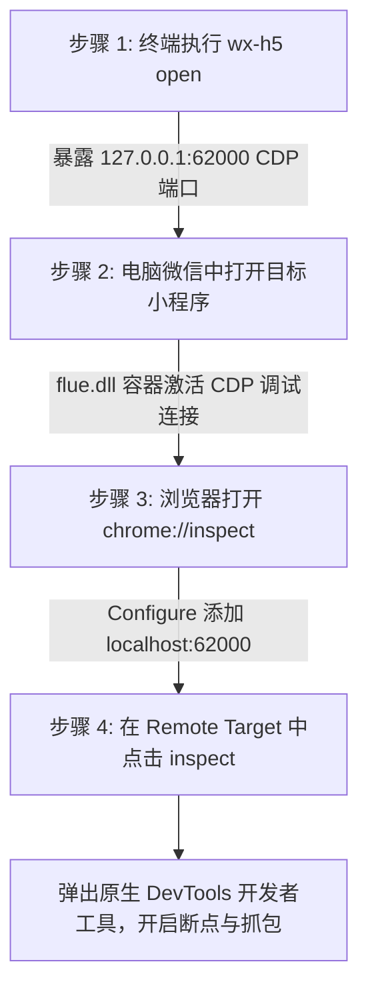
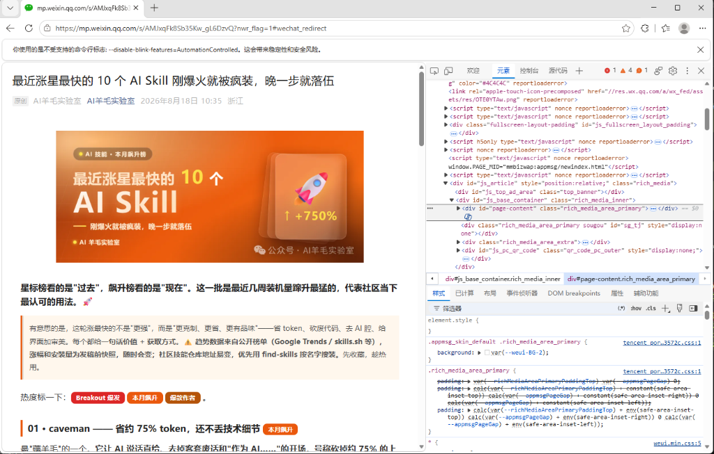
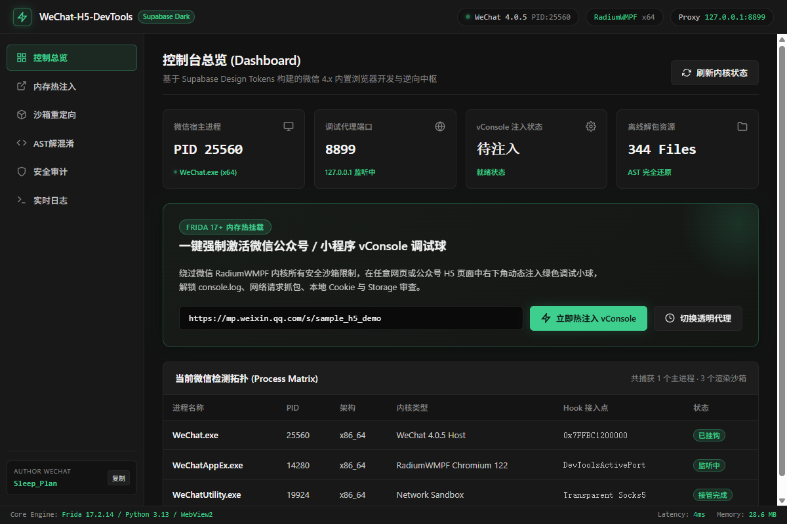

<div align="center">


# WeChat-H5-DevTools

**WMPFDebugger 内置浏览器与公众号 H5 满血调试与逆向工具箱**

[](https://www.python.org/)
[](https://nodejs.org/)
[](https://creativecommons.org/licenses/by-nc-sa/4.0/)
[](https://frida.re/)
[](https://github.com/)

[核心功能](#features) · [实测效果](#screenshots) · [快速上手](#quickstart) · [公众号/H5调试SOP](#h5-sop) · [小程序调试SOP](#miniapp-sop) · [图形界面](#gui) · [命令行指南](#cli) · [实战工作流](#workflows) · [兼容矩阵](#matrix) · [版本下载与归档](#wechat-versions) · [常见问题](#faq) · [开源鸣谢](#attribution) · [赞助支持](#sponsor) · [交流群](#community) · [免责声明](#disclaimer)

</div>

---

<a id="background"></a><a id="项目背景"></a>
## 项目背景

微信 4.x 架构升级后屏蔽了内置浏览器的 F12 响应与 Inspector 菜单，外部脱机调试亦面临“请在微信客户端打开链接”、`WeixinJSBridge` 缺失与分包提取困难等问题。

**`WeChat-H5-DevTools`** 针对上述痛点提供一体化解决方案，涵盖微信内核免按键调试注入、微信内核原生 CDP 远程调试服务 (直连微信原生窗口免弹窗)、脱机 JSSDK 模拟沙箱、本地热重载 (Local Overrides)、自动化 AST 语法树解混淆与接口安全审计。

---

<a id="matrix"></a><a id="兼容矩阵"></a><a id="版本与内核兼容矩阵"></a><a id="微信版本与内核兼容矩阵"></a>
## 微信版本与 RadiumWMPF 内核兼容矩阵 (Compatibility Matrix)

为了方便非专业开发者与安全研究人员一目了然，下表列出了工具对微信全系列主流版本、**`RadiumWMPF` 内核版本**架构及核心进程的深度适配支持情况：

| 微信客户端大版本 | 典型测试验证版本 | RadiumWMPF 内核版本 (Kernel) | 渲染/Web 核心进程名 | 调试注入机制 | 兼容状态 |
| :--- | :--- | :--- | :--- | :--- | :--- |
| **微信 4.1.x 最新版**<br>*(当前主推)* | **`4.1.13.12`**<br>`4.1.12.26`<br>`4.1.5.30` | **`25560`** / **`25510`** / `25497` / `25364` / `20089` | `WeixinExt.exe`<br>`Weixin.exe` (`--type=renderer`) | Frida 动态拦截 `CreateProcessW` 挂载注入<br>+ 透明代理无感注入 `vConsole`<br>+ 内核暴露 62000 端口 CDP 直连 | `[PASS]` 满血完美支持 |
| **微信 4.0.x 系列**<br>*(重构初期)* | `4.0.2`<br>`4.0.1`<br>`4.0.0` | **`16389` / `16203` / `16133` / `14315`**<br>*(Blink 深度重构版架构)* | `Weixin.exe`<br>`WeChatAppEx.exe` | 进程自适应探测与多点命令行注头 | `[PASS]` 满血完美支持 |
| **微信 3.9.x 经典版**<br>*(长期支持)* | `3.9.12`<br>`3.9.11`<br>`3.9.10` 及旧版 | **`11581` ~ `13909`**<br>*(经典 XWeb / Chromium 85~108)* | `WeChat.exe`<br>`WeChatAppEx.exe` | 经典 `--xweb-enable-inspect=1` 参数注入通道 | `[PASS]` 满血完美支持 |
| **微信内核 CDP 调试**<br>*(直连原生窗口)* | 最新微信客户端<br>(Win / Mac) | **RadiumWMPF 原生内核**<br>*(Blink/XWeb 内核)* | `WeixinExt.exe`<br>`Weixin.exe` | 启动内核 CDP 服务暴露 62000 端口<br>Edge/Chrome `edge://inspect` 直连 | `[PASS]` 微信内置原生窗口 |
| **外部脱机模拟沙箱**<br>*(免微信客户端)* | 任意操作系统<br>(Win / Mac / Linux) | **Edge / Chrome 最新版**<br>*(Chromium 130+ 满血原生引擎)* | `msedge.exe`<br>`chrome.exe` | `document_start` 毫秒级注入 30+ WeixinJSBridge Mock (`--sandbox`) | `[PASS]` 满血原生 F12 |

> **[INFO] 如何查看本机的 RadiumWMPF 内核版本？**
> 1. 按快捷键 `Win + R` 打开运行窗口，粘贴并回车：
>    ```text
>    %AppData%\Tencent\xwechat\XPlugin\Plugins\RadiumWMPF
>    ```
> 2. 打开后看到的以纯数字命名的文件夹（如 `25510`、`17127`、`16389` 等），该数字即为本机微信当前正在生效使用的 **RadiumWMPF 内核版本号**！
> 3. 工具内置了 `WeChatFinder` 与多源版本探测器，全自动适配上述所有版本，无需手动配置偏移。

<a id="wechat-versions"></a><a id="版本下载与归档"></a><a id="微信版本下载与旧版本归档"></a>
### 推荐微信版本下载与全量旧版本归档 (Download & Archive)

如果您的电脑尚未安装微信、当前微信版本不受支持、或需要安装历史稳定版本进行兼容性回归验证：
- **专有指引文档**：关于官方正式版、推荐黄金稳定版本及降级安装防数据覆盖注意事项，请直接查看项目文档 [微信版本指引与归档索引](docs/wechat_versions.md)。
- **社区成熟历史版本库直接引用（免重复维护）**：
  - **Windows 4.x 全量历史版本自动归档库（每小时检测，官方安装包与 SHA256）**：[cscnk52/wechat-windows-versions](https://github.com/cscnk52/wechat-windows-versions)（[Releases 下载区](https://github.com/cscnk52/wechat-windows-versions/releases)）
  - **Windows 3.x 经典全量历史版本归档库（3000+ Stars，收录 3.9.x ~ 3.5.x 官方全量安装包）**：[tom-snow/wechat-windows-versions](https://github.com/tom-snow/wechat-windows-versions)（[Releases 下载区](https://github.com/tom-snow/wechat-windows-versions/releases)）
  - **Windows 32位 (x86) 专区**：[tom-snow/wechat-windows-versions-x86](https://github.com/tom-snow/wechat-windows-versions-x86)
  - **Mac 微信 3.x / 4.x 历史版本归档库（1100+ Stars）**：[zsbai/wechat-versions](https://github.com/zsbai/wechat-versions)（[Releases 下载区](https://github.com/zsbai/wechat-versions/releases)）
  - **微信官网最新正式版**：[pc.weixin.qq.com](https://pc.weixin.qq.com/)

#### 路径 1 技术说明：为什么右键没有「检查」？是否需要降级微信？

> **[IMPORTANT] 核心原则：强烈建议【不要进行微信降级】！当前微信最新版本（4.1.x）已完全够用！**

1. **为什么在当前微信 4.1.x 文章内右键看不到「检查」？**
   - **历史版本（微信 3.9.x / 4.0 早期版）**：Chromium 内核中保留了 `--xweb-enable-inspect=1` 参数接口与 Inspector 右键菜单项。通过简单的启动劫持或参数注入，即可恢复右键「检查」。
   - **最新版（微信 4.1.x，如 `4.1.13.12` / RadiumWMPF `25510`+）**：腾讯官方在魔改 Chromium 内核（`flue.dll`）中物理删除了右键上下文菜单项，并在内核启动阶段主动忽略了外部传入的 `--remote-debugging-port` 与 `--xweb-enable-inspect` 命令行参数。
2. **为什么强烈建议不要进行降级操作？**
   - **理由一（聊天数据安全）**：新版微信的本地 SQLite 数据库、多端同步协议与会话架构已发生重大升级。跨大版本强行降级安装旧版微信，极易引发本地数据库格式损坏或聊天记录丢失；
   - **理由二（最新版本已经完全够用）**：
     - **公众号与 H5 调试**：直接运行 `wx-h5 proxy`，微信内置浏览器文章就地刷新即可浮现绿色 `vConsole` 开发者面板，抓包 Network、看 Console 报错、查 Cookie 与 Storage 100% 具备；
     - **脱机全功能逆向**：直接运行 `wx-h5 open <url> --sandbox`，秒级拉起高保真模拟沙箱并排双开满血原生 F12，彻底免除微信客户端束缚；
     - **小程序调试**：直接运行 `wx-h5 open`，通过底层场景值映射，在 Chrome `chrome://inspect` 仍可满血直连 62000 端口原生 F12。
   - **结论**：日常开发、抓包排障与逆向审计在当前最新版微信下均可顺畅闭环，**完全无需降级微信**。

---

<a id="quickstart"></a><a id="快速上手"></a><a id="新手起步"></a><a id="小白新手三步起飞"></a>
## 快速上手 (Quick Start)

### 1. 环境安装
```bash
git clone https://github.com/xuange520/WeChat-H5-DevTools.git
cd WeChat-H5-DevTools
pip install -r requirements.txt
pip install -e .
```

### 2. 核心调试场景速查

| 调试需求 | 执行命令 | 调试表现与输出 |
| :--- | :--- | :--- |
| **微信文章/H5 就地调试** | `wx-h5 proxy` | 微信文章内刷新即现绿色 **vConsole** 面板，就地查看 Log 与抓包 |
| **微信内核 CDP 原生直连** | `wx-h5 open` | 启动微信公众号内核浏览器 CDP 调试服务 (直连微信内置原生窗口，免弹外部浏览器)，默认暴露 `62000` 端口；在 `chrome://inspect` 或 `edge://inspect` 挂载原生 F12 |
| **脱机模拟沙箱调试** | `wx-h5 open <url> --sandbox` | 脱离本地微信客户端，自动注入 WeixinJSBridge Mock 并排双开 F12 |
| **批量 AST 解混淆** | `wx-h5 deobfuscate <dir>` | 工业级 AST 逆向解混淆与 Webpack 分包还原 |
| **API 与密码学审计** | `wx-h5 scan <dir> -e report.md` | 自动扫描后端域名、API 路由、敏感凭据与国密加密算法 |
| **桌面 GUI 可视化工作台** | `python examples/supabase_gui/app.py` | 启动 Fluent 桌面客户端，一键执行注入与日志审查 |

---

<a id="h5-sop"></a><a id="公众号h5调试sop"></a><a id="微信公众号推文与h5调试sop"></a>
## 微信公众号推文 / H5 页面正确调试 SOP

针对微信 4.x 内置浏览器对公众号推文与 H5 页面的安全机制，本节提供权威的标准作业程序（SOP）与 4 大经过实测验证的最快调试操作顺序。

### 微信公众号推文 / H5 页面 4 大最快调试操作顺序

根据不同调试需求，长官可任选以下最适合的满血调试方案：

| 调试方案 | 核心命令 / 触发方式 | 适用场景 | 核心优势 | 耗时 |
| :--- | :--- | :--- | :--- | :--- |
| **方式 1 (最简便首选)** | `wx-h5 proxy`<br>+ 微信文章内点击刷新 | 在微信真实登录态、JSSDK、支付环境下查报错与抓包 | 文章右下角就地浮现绿色 vConsole 按钮，免外部浏览器 | 10 秒 |
| **方式 2 (经典版/降级分支)** | 微信 3.9.x 经典版文章窗口<br>空白处右键「检查」 | 仅适用于微信 3.9.x 历史版本；最新 4.1.x 已移除该菜单，建议直接用方式 1 | 原地呼出原生 DevTools（最新 4.1.x 无需降级，方式 1 已完全够用） | 3 秒 |
| **方式 3 (白板秒级直达)** | 已弹出的 DevTools 窗口<br>地址栏直接粘贴推文 URL 回车 | 已通过 inspect 唤起 about:blank 窗口，需快速定向加载推文 | 解决 about:blank 最快手段，立即录制网络请求与控制台报错 | 5 秒 |
| **方式 4 (脱离微信客户端)** | `wx-h5 open <url> --sandbox` | 脱离本地微信客户端独立调试，或在 Chrome/Edge 满血逆向 | 自动注入 WeixinJSBridge Mock 与微信 UA，并排自动双开 F12 | 5 秒 |

#### 方式 1 详解：运行 `wx-h5 proxy` 刷新推文获得右下角 vConsole 绿标
1. **步骤 1（启动透明代理）**：在终端运行：
   ```bash
   wx-h5 proxy
   ```
   *(工具将在本地启动 8899 端口轻量透明代理网关)*；
2. **步骤 2（切换至微信文章）**：在电脑微信中正常打开需要调试的目标公众号推文或 H5 页面；
3. **步骤 3（就地刷新文章）**：在微信文章窗口右上角点击三个点 **`...`** -> 选择 **「刷新」**；
4. **步骤 4（展开调试控制台）**：页面刷新完成后，文章右下角将自动浮现醒目的绿色 **vConsole** 按钮，点击即可就地展开 Console 日志、Network 网络抓包、Storage 缓存与 Elements DOM 节点树！

#### 方式 2 详解：微信 3.9.x 经典版文章窗口右键「检查」唤起原生 DevTools（路径 1 降级分支）
> **[IMPORTANT] 版本特别说明：**
> 1. **仅限历史版本**：本方式仅在微信 3.9.12.x 及更早版本的经典单进程架构下有效。
> 2. **微信 4.1.x 最新版现状**：腾讯官方在 4.1.x 中物理移除了右键菜单与 `--xweb-enable-inspect` 外部传参。
> 3. **强烈建议不要降级**：新版微信聊天记录数据库结构已升迁，跨大版本逆向降级存在数据损坏风险；且本项目最新版提供的**方式 1（透明代理注入 vConsole）**与**方式 4（脱机沙箱双开 F12）**已完全覆盖全部调试需求，**当前最新版本已经完全够用，切勿降级！**

1. **步骤 1**：在微信 3.9.x 经典客户端中打开公众号推文或网页窗口；
2. **步骤 2**：将鼠标移动至文章页面任意空白区域（文字段落或图片周围空白处）；
3. **步骤 3**：单击鼠标**右键**，在弹出的右键菜单中点击 **「检查」 (Inspect)** 或 **「审查元素」**；
4. **步骤 4**：微信将直接原地弹出独立的 Chromium 原生开发者工具窗口。*(注：如果您使用的是微信 4.1.x 最新版，请直接按上方【方式 1】操作，就地秒级呼出完整调试面板，安全高效！)*

#### 方式 3 详解：在弹出的 DevTools 窗口地址栏直接粘贴推文 URL 回车加载
1. **步骤 1**：若你已经通过 `chrome://inspect` 点击 inspect 弹出了显示 `about:blank` 的 DevTools 窗口；
2. **步骤 2**：回到微信公众号推文窗口，点击右上角三个点 **`...`** -> 点击 **「复制链接」**；
3. **步骤 3**：切换回已弹出的 DevTools 窗口，点击左侧视口顶部的**地址栏**；
4. **步骤 4**：粘贴刚才复制的公众号推文链接，按下键盘 **Enter 回车键**；
5. **步骤 5**：DevTools 窗口将立即定向加载推文内容，此时 Network 面板将完整录制所有网络请求，Console 控制台也将同步输出全部报错与运行日志！

#### 方式 4 详解：运行 `wx-h5 open <url> --sandbox` 高保真沙箱双开 F12
1. **步骤 1**：在微信推文右上角点击 `...` 复制推文链接；
2. **步骤 2**：在终端执行沙箱启动命令：
   ```bash
   wx-h5 open "https://mp.weixin.qq.com/s/AMJxqFk8Sb35Kw_gL6DzvQ" --sandbox
   ```
3. **步骤 3**：工具将自动启动独立 Chromium 沙箱实例，在 `document_start` 阶段自动模拟微信 User-Agent 与 30+ 常见 `WeixinJSBridge` 原生 API Mock；
4. **步骤 4**：沙箱窗口与原生 F12 开发者工具将**自动并排启动**，彻底解除“请在微信客户端打开链接”的阻断限制，无需依赖本地微信即可脱机调试！

---

<a id="miniapp-sop"></a><a id="小程序调试sop"></a><a id="微信小程序标准调试sop"></a>
## 微信小程序标准调试 SOP

微信 PC 端小程序运行于 `flue.dll` (RadiumWMPF) 容器沙箱中，支持通过标准的 Chrome DevTools Protocol (CDP) 进行高保真远程挂载调试。

### 一、 微信小程序调试 4 步标准操作顺序



1. **第一步：启动微信内核 CDP 调试服务**
   - 在终端中执行命令：
     ```bash
     wx-h5 open
     ```
   - 工具将**启动微信公众号内核浏览器 CDP 调试服务 (直连微信内置原生窗口，免弹外部浏览器)**，默认暴露 `62000` 端口 CDP 接口（`127.0.0.1:62000`）。保持该命令行窗口持续运行。

2. **第二步：电脑微信客户端打开目标小程序**
   - 打开 PC 微信客户端，正常点击启动你需要调试的任意微信小程序；
   - 微信小程序主界面渲染后，底层 RadiumWMPF 内核将自动与 CDP 服务建立双向通信通道。

3. **第三步：Chrome / Edge 配置挂载并唤起 DevTools**
   - 打开 Google Chrome 浏览器，在地址栏输入并回车：
     ```text
     chrome://inspect
     ```
     *(若使用 Microsoft Edge 浏览器，则输入 `edge://inspect`)*；
   - 确认勾选 **Discover network targets**，点击右侧的 **Configure...** 按钮；
   - 在弹出的靶标列表中添加微信 CDP 服务地址：
     ```text
     localhost:62000
     ```
     *(或 `127.0.0.1:62000`)*，点击 **Done** 保存；
   - 稍等 1~2 秒，页面下方的 **Remote Target** 将实时枚举出当前正在运行的小程序页面卡片（包含小程序名称与页面路由）；
   - 点击目标小程序卡片下方的蓝色 **inspect** 链接，即可原地弹出满血原生 DevTools 开发者工具窗口，直接对小程序进行断点调试、Console 日志输出与 Network 网络监控！

4. **第四步：AI 智能体与自动化测试接入 (miniapp-cdp-mcp)**
   - 工具暴露的标准 CDP 接口原生兼容 **`miniapp-cdp-mcp`**、Puppeteer 与 Playwright；
   - AI 智能体或自动化脚本可直接通过 WebSocket 直连 `ws://127.0.0.1:62000` 下发 CDP 控制指令，实现全自动断点逆向、WXML 节点提取、网络 HAR 录制与前端源码抓取。

---

<a id="screenshots"></a><a id="实测效果"></a><a id="实战效果"></a>
## 微信内置推文实盘调试效果展示 (Live Screenshots)

本项目全面支持 **微信客户端内无感注入** 与 **微信内核 CDP 调试 / 外部高保真脱机沙箱** 满血调试工作流，基于最新微信客户端（`4.1.13.12`）与 `RadiumWMPF` 内核实测通过：

### 模式一：微信内置浏览器无感注入（免修改二进制，右下角常驻 vConsole 浮动绿标）

<div align="center">

| 微信公众号推文右下角常驻绿色 vConsole 按钮 | 点击绿色按钮即刻展开移动端完整控制台 |
| :---: | :---: |
|  |  |
| *图 1：微信内置浏览器打开任意推文，右下角自动浮现 vConsole 绿标* | *图 2：点击绿标即刻展开 Console、Network 抓包、Storage 与 DOM 树* |

</div>

<br>

### 模式二：微信公众号内核浏览器 CDP 调试服务 (直连微信内置原生窗口，免弹外部浏览器)

通过一行命令 `wx-h5 open` 即可启动微信公众号内核浏览器 CDP 调试服务，暴露 `62000` 端口 CDP 接口，直连微信内置原生文章窗口进行满血调试（免弹外部浏览器）：
- **Google Chrome 挂载**：在 Chrome 地址栏访问 `chrome://inspect`，点击 Configure 添加 `localhost:62000`，点击目标下方的 `inspect` 即可弹出满血 F12 控制台；
- **Microsoft Edge 挂载**：在 Edge 地址栏访问 `edge://inspect`，配置添加 `localhost:62000` 挂载；
- **DevTools 秒级直达**：在 Chrome/Edge 中直接访问 `devtools://devtools/bundled/inspector.html?ws=127.0.0.1:62000`；
- **AI 智能体操控**：通过 `miniapp-cdp-mcp` 自动化下发断点、获取源码与抓包。

同时支持脱机模拟沙箱：如需使用旧版脱机模拟沙箱，可通过 `wx-h5 open <url> --sandbox` 拉起独立沙箱环境，自动并排开启原生 F12 开发者工具与 CDP 调试通道：

<div align="center">



*图 3：微信公众号内核 CDP 服务暴露 62000 端口与原生 DevTools 控制台、Network 网络监控联调界面*

</div>

---

<a id="features"></a><a id="核心功能"></a><a id="核心功能全景"></a>
## 核心功能全景

* **微信公众号内核浏览器 CDP 调试服务**：通过 `wx-h5 open` 启动微信公众号内核浏览器 CDP 调试服务 (直连微信内置原生窗口，免弹外部浏览器)，暴露 `62000` 端口 CDP，在 Edge/Chrome 输入 `edge://inspect` 或 `devtools://...` 直连微信内置文章窗口，或通过 `miniapp-cdp-mcp` 自动化下发断点与采集；
* **进程级调试通道挂载**：基于 Frida 动态挂钩微信主进程，自适应适配微信 3.x / 4.x 多架构，拦截并挂载调试参数；
* **透明代理注入 vConsole**：轻量本地代理网关，自动向访问的 H5 网页注入 `vConsole` / `Eruda` 移动端调试面板；
* **本地代码热重载 (Local Overrides)**：支持本地单文件映射替换线上 JS/CSS，自动禁用强缓存与放行跨域，即改即生效；
* **脱机高保真沙箱与 JSSDK 模拟 (--sandbox)**：内置全平台微信 UA 矩阵与 30+ 常见 `WeixinJSBridge` API Mock，脱离微信独立在 Chrome/Edge 开启原生 F12 调试；
* **Webpack 分包递归提取**：输入目标 H5 链接，自动递归下载主包与异步 Chunk JS、CSS 及静态资产；
* **AST 深度解混淆与模块解包**：基于 Babel AST 引擎，执行常量折叠、标识符重命名与 Webpack 单体包拆解还原；
* **SourceMap 源码还原**：自动探测并解包 SourceMap，将编译混淆代码还原为原始 Vue 单文件组件与 TypeScript 源码；
* **全域 API 路由与密码学安全审计**：静态审计 JS 代码，自动提取后端域名、网络库调用、国密算法 (SM2/SM3/SM4)、非对称加密 (RSA) 与业务 API 清单。

---

<a id="gui"></a><a id="图形界面"></a><a id="gui启动指南"></a><a id="gui操作指南"></a>
## 图形交互界面 (GUI) 完整操作指南

除了强大的命令行 CLI 工具外，本项目提供了开箱即用的现代桌面可视化客户端，支持全图形化点选与可视化状态监控：

<div align="center">



</div>

### 一、 现代 Fluent 桌面工作台架构
工作台基于微软 Fluent Design 与 Supabase 暗黑极简设计规范构建，底层通过 Windows 原生 WebView2 硬件加速引擎渲染：
- **无依赖双向通信**：基于 Python 与前端原生 Bridge 双向中继，无需在宿主机额外安装大型重型 GUI 依赖；
- **多标签页路由编排**：内置控制总览、内存热注入、沙箱重定向、AST 解混淆、安全审计与实时流水日志 6 大专属面板；
- **物理日志零丢失保障**：所有操作与控制台流 100% 实时安全同步追加存盘至本地 `records/logs/console_stream.log`；
- **原生 UAC 权限提权**：客户端内置管理员权限清单，双击自动获得完整注入能力。

**启动方式**：
```bash
# 方式 A：通过 CLI 命令一键唤起
wx-h5 gui

# 方式 B：直接执行 Python 脚本入口
python examples/supabase_gui/app.py
```
> *环境要求：Windows 10/11（Windows 11 自带 WebView2 运行时；Win10 用户需确保已安装 Microsoft Edge WebView2 运行时）。*

---

### 二、 GUI 客户端标准操作顺序 (Step-by-Step SOP)

1. **第一步（启动工作台）**：
   在终端运行 `wx-h5 gui` 或 `python examples/supabase_gui/app.py`，系统将自动拉起桌面客户端窗口；
2. **第二步（确认微信内核感知）**：
   观察顶部状态胶囊与「控制总览」看板，确认微信主进程 PID、`RadiumWMPF` 内核版本号（如 `25510`、`25560`）以及本地透明代理端口（`127.0.0.1:8899`）显示为活跃状态；
3. **第三步（执行目标调试动作）**：
   - **公众号 / H5 调试**：在控制总览页面的输入框中填入目标 H5 链接（或留空全局生效），点击 **「立即热注入 vConsole」**，随后在电脑微信打开文章并刷新；
   - **透明代理控制**：点击 **「切换透明代理」** 可随时启停本地 8899 端口代理监听；
   - **精细化注入配置**：切换至「内存热注入」标签页，按需勾选“激活 vConsole”、“开启 Eruda”、“绕过 JSSDK 签名”或“解锁右键检查”，点击 **「应用注入策略」**；
   - **本地热重载**：切换至「沙箱重定向」标签页，点击 **「添加重定向规则」** 将线上 JS 映射到本地文件进行秒级热替换；
   - **AST 逆向解混淆**：切换至「AST解混淆」标签页，输入目标代码目录，点击 **「启动 AST 批量反混淆」**；
   - **敏感凭据扫描**：切换至「安全审计」标签页，点击 **「重新扫描」** 自动提取代码中的 AppSecret、Token、AES 密钥与 API 路由；
4. **第四步（物理日志存盘与导出）**：
   切换至「实时日志」标签页，实时观察内核流，并可通过顶部的 **「复制全部日志」**、**「打开本地日志」** 或 **「定位日志目录」** 进行物理存证。

---

### 三、 物理日志持久化管理与安全保障

工作台采用本地物理日志双向同步存盘机制：

1. **落盘路径标准化**：
   - 物理日志固定存盘路径为项目根目录：
     ```text
     records/logs/console_stream.log
     ```
2. **增量安全追加写入**：
   - 日志输出采用高容错追加模式（`a+`），每条日志均打上标准时间戳 `[%Y-%m-%d %H:%M:%S]` 与纯文本标签（`[INFO]`、`[SUCCESS]`、`[HOOK]`、`[PROXY]`、`[ERROR]`）；
3. **零跨盘污染保障**：
   - 严格遵循绝对零污染 C 盘原则，所有日志与存证 100% 收拢在项目本地工作区，严禁写入 AppData、Temp 或系统盘目录。

---

<a id="cli"></a><a id="命令行指南"></a><a id="命令行操作指南"></a>
## 命令行操作指南

你可以通过全局别名 `wx-h5 <命令>` 或 `python main.py <命令>` 进行调用。

### 核心命令与参数索引表

| 命令 | 核心功能 | 核心参数与选项 | 典型调用范例 |
| :--- | :--- | :--- | :--- |
| `doctor` | 本地微信、浏览器与 Frida 环境诊断 | 无 | `wx-h5 doctor` |
| `gui` | 启动 Fluent 现代暗黑桌面可视化工作台 | 无 | `wx-h5 gui` |
| `hook` | 微信客户端进程级 DevTools 参数注入 | `--path, -p` (指定微信主程序路径) | `wx-h5 hook` |
| `proxy` | 启动 vConsole 移动端透明代理网关 | `--port, -p` (默认 8899), `--override-dir, -d` | `wx-h5 proxy --port 8899 -d ./local_js` |
| `override` | 本地代码实时替换与热重载 | `<override_dir>`, `--port, -p` | `wx-h5 override ./local_js --port 8899` |
| `open` | 启动微信公众号内核浏览器 CDP 调试服务 (直连微信内置原生窗口，免弹外部浏览器) | `--port, -p` (默认 62000), `[url]`, `--sandbox` (使用脱机模拟沙箱) | `wx-h5 open`<br>`wx-h5 open "https://..." --sandbox` |
| `dump` | 全站 Webpack 异步分包递归抓取 | `<url>`, `-o` (输出目录), `-d` (抓取后自动解混淆) | `wx-h5 dump "https://..." -o ./site -d` |
| `deobfuscate` | 批量 AST 语法树解混淆与模块解包 | `<target_dir>`, `-o` (输出目录), `-a / --all` (批量子工程) | `wx-h5 deobfuscate ./site -a` |
| `restore` | 从 SourceMap 逆向还原 Vue/TS 源码 | `<target_dir>`, `-o` (输出目录) | `wx-h5 restore ./site` |
| `scan` | 静态审计提取域名、API、国密与凭据 | `<target_dir>`, `-e` (导出MD报告), `-a / --all` | `wx-h5 scan ./site -e report.md` |

---

<a id="workflows"></a><a id="实战工作流"></a><a id="实战场景"></a>
## 四大经典实战工作流

### 场景 1：在微信客户端内部直接唤出调试器 (vConsole 浮动绿标)
*适用场景：需要在真实微信登录态、支付环境或企业微信内部调试页面。*

1. **启动透明代理网关**：
   ```bash
   wx-h5 proxy --port 8899
   ```
2. **配置微信或系统代理**：
   将系统代理或网络抓包工具的上游代理设置为 `127.0.0.1:8899`。
3. **打开任意公众号网页**：
   页面右下角将自动浮现绿色 `vConsole` 按钮，点击即可实时查看 Console 日志、Network 抓包、Storage 缓存与 Elements DOM 树！

> [NOTE] 运行效果请参考上方 [实测效果展示 - 模式一](#screenshots)。

---

### 场景 2：本地代码实时映射替换与热重载 (Local Overrides)
*适用场景：本地修改线上 JS/CSS 脚本并在微信中实时验证效果，免除重新打包流程。*

1. **准备本地修改后的 JS 文件**（例如 `D:/debug_js/chunk-common.js`）；
2. **启动 Local Overrides 拦截服务**：
   ```bash
   wx-h5 override D:/debug_js --port 8899
   ```
3. **刷新网页**：
   当网页请求该脚本时，代理网关将自动命中并**以本地文件秒级替换返回**（自动禁用缓存并放行跨域），修改本地代码立即生效！

---

### 场景 3：微信内核 CDP 调试实盘玩法 (直连微信内置原生窗口，免弹外部浏览器)
*适用场景：需要在微信原生环境下直接调试正在阅读的公众号文章、企业微信微盘应用，查看真实登录态请求、Cookie、DOM 节点树或通过 CDP 进行自动化操控，免受外部脱机浏览器环境缺失影响。*

1. **启动微信公众号内核浏览器 CDP 调试服务**：
   ```bash
   # 启动微信内核 CDP 调试服务（直连微信内置原生窗口，默认暴露 62000 端口）
   wx-h5 open
   ```
   服务启动后将自动暴露微信内核 CDP 调试端口 `127.0.0.1:62000`。

2. **在 Chrome / Edge 中挂载原生调试窗口**：
   - **Chrome 挂载**：访问 `chrome://inspect` -> 点击 **Configure...** 添加 `localhost:62000` -> 在 Remote Target 列表中点击目标文章的 **inspect** 即可呼出原生 DevTools；
   - **Edge 挂载**：访问 `edge://inspect` -> 同样添加 `localhost:62000` 挂载；
   - **直达 URL**：直接在浏览器输入 `devtools://devtools/bundled/inspector.html?ws=127.0.0.1:62000` 直连。

3. **通过 miniapp-cdp-mcp 进行 AI 自动化操控**：
   - 工具暴露的 `http://127.0.0.1:62000` 标准 CDP 接口原生兼容 **`miniapp-cdp-mcp`**、Playwright 与 Puppeteer。
   - AI 智能体或自动化脚本可直接下发 CDP 指令，对微信内置原生窗口进行页面抓取、DOM 遍历、截图留证与无感交互自动化。

4. **脱机模拟沙箱回退支持 (--sandbox)**：
   若需脱离微信客户端独立在外部浏览器中模拟打开链接，可加上 `--sandbox` 参数降级至脱机模拟沙箱：
   ```bash
   # 启动外部独立高保真沙箱打开公众号推文（自动注入 WeixinJSBridge Mock 并双开 F12）
   wx-h5 open "https://mp.weixin.qq.com/s/AMJxqFk8Sb35Kw_gL6DzvQ" --sandbox

   # 指定使用 Edge 浏览器并模拟 iPhone 微信环境
   wx-h5 open "https://mp.weixin.qq.com/s/xxxx" --sandbox --browser edge --ua ios

   # 指定使用 Chrome 浏览器并模拟 Android 微信环境
   wx-h5 open "https://mp.weixin.qq.com/s/xxxx" --sandbox --browser chrome --ua android
   ```

> [NOTE] 运行效果请参考上方 [实测效果展示 - 模式二](#screenshots)。

---

### 场景 4：批量 AST 解混淆与全域静态逆向代码审计
*适用场景：面对混淆压缩的 JS 代码或小程序单体包，恢复其模块结构并提取后端接口清单与加密算法。*

```bash
# 1. 批量解混淆某个总目录下的所有子版本/子小程序工程
wx-h5 deobfuscate "./output/wx1363195c4fb75cfc" --all

# 2. 执行静态扫描并导出高质感 Markdown 审计报告
wx-h5 scan "./output/wx1363195c4fb75cfc/344_deobfuscated" --export audit_report.md
```

**扫描报告涵盖**：
* **后端业务域名 (Base URLs)**：提取硬编码的业务 API 接口域名；
* **网络请求框架**：识别 `wx.request`, `uni.request`, `@haici/request-core`, `axios` 等；
* **密码学与加密特征**：识别国密 SM2/SM3/SM4、TripleDES、AES、RSA/jsbn、HMAC-SHA256、JWT/jtoken、时间戳防重放签名；
* **凭据与敏感字段**：识别微信 AppID、插件依赖 ID、业务 Token 与请求头；
* **业务 API 清单**：提纯去重全量 RESTful 与 RPC 路由接口。


---

<a id="faq"></a><a id="常见问题"></a>
## 常见问题精选与排障索引 (FAQ)

为了保持主页文档精炼，涵盖内核脱钩机制、多进程沙箱识别、强缓存粉碎、Node 堆扩容与提权等全量 11 大核心疑难方案，已统一收拢归档至独立技术全书：

**[点击查阅完整技术全书：常见问题排障全书 (FAQ.md)](./docs/FAQ.md)**

### 高频速查 TOP 3：

<details>
<summary><strong>Q1: 运行 <code>wx-h5</code> 提示“无法识别为 cmdlet 或命令”？</strong></summary>

> **解答**：请在项目根目录运行 `pip install -r requirements.txt` 和 `pip install -e .`，或直接使用 `python main.py <命令>` 执行。详见 [FAQ.md: Q1](./docs/FAQ.md#q1-运行-wx-h5-提示无法识别为-cmdlet-或命令)。
</details>

<details>
<summary><strong>Q2: 执行 <code>wx-h5 hook</code> 提示“已有微信进程在运行”？</strong></summary>

> **解答**：微信在开启状态下无法注入调试参数。请彻底退出系统托盘微信，或在终端运行 `taskkill /F /IM WeChat.exe /IM Weixin.exe /IM WeChatAppEx.exe /T` 后重试。详见 [FAQ.md: Q2](./docs/FAQ.md#q2-执行-wx-h5-hook-提示已有微信进程在运行)。
</details>

<details>
<summary><strong>Q3: 微信公众号网页提示“请在微信客户端打开”如何调试？</strong></summary>

> **解答**：推荐首选使用 `wx-h5 open` 启动微信公众号内核浏览器 CDP 调试服务，直接在微信客户端内打开页面并通过 `edge://inspect` 挂载调试，拥有 100% 真实微信原生环境；如使用脱机沙箱调试，请加上 `--sandbox` 参数（如 `wx-h5 open "<URL>" --sandbox --browser edge --ua ios`），工具会在 `document_start` 毫秒级自动注入包含 30+ 接口的 `WeixinJSBridge` 模拟沙箱。详见 [FAQ.md: Q3](./docs/FAQ.md#q3-外部脱机浏览器打开仍提示请在微信客户端打开或特定-jssdk-接口未响应)。
</details>

> [NOTE] **更多疑难排障（代理端口抢占、Node 8GB 堆内存溢出、CDN 403 跨域、UAC 权限提权、GUI 启动异常等）**：请直接移步至 [docs/FAQ.md](./docs/FAQ.md) 查阅完整解答。

---

<a id="sponsor"></a><a id="赞助与支持"></a><a id="赞助支持"></a>
## 赞助与支持 (Sponsor)

如果本项目在日常开发或安全审计中切实帮助到了您，欢迎赞助支持项目的持续维护与内核适配：

<div align="center">

|  |  |
| :---: | :---: |
| 支付宝 | 微信支付 |

</div>

> **[INFO] 赞助权益**：赞助者的适配需求享有第一响应优先级，赞助名单将收录于致谢榜。

---

<a id="community"></a><a id="交流群"></a><a id="官方交流群"></a>
## 官方技术交流群 (Community)

欢迎加入官方微信交流群交流微信逆向与 Web 调试技术：

<div align="center">


<br>

> **[INFO] 入群方式**：微信扫码即可加入；若二维码过期请添加作者微信 **`Sleep_Plan`**（备注：**DevTools 入群**）。

</div>

---

<a id="author"></a><a id="作者与联系方式"></a>
## 作者与联系方式

- **作者 / 核心开发者**：**xuange520**
- **官方微信 (推荐首选)**：`Sleep_Plan` (微信逆向交流 / 商务合作 / 疑难排障)
- **官方邮箱**：`2603066228@qq.com` / `xuangeylw@gmail.com`
- **GitHub 主页**：[@xuange520](https://github.com/xuange520)
- **项目开源仓库**：[WeChat-H5-DevTools](https://github.com/xuange520/WeChat-H5-DevTools)

---

<a id="attribution"></a><a id="开源鸣谢"></a><a id="开源引用与技术借鉴"></a>
## 开源引用、技术借鉴与鸣谢 (Attribution & Acknowledgements)

本项目遵循开源社区技术诚信准则（Academic & Technical Integrity）。在研发攻坚过程中，深度借鉴、引用并受启发于以下优秀的开源项目与社区先驱成果，特此致以最崇高的敬意：

### 1. 核心底层依赖与直接调用组件

| 开源项目 | 官方仓库地址 (GitHub) | 开源许可证 | 本项目核心作用与应用场景 |
| :--- | :--- | :--- | :--- |
| **Frida** | [frida/frida](https://github.com/frida/frida) | wxWindows | 全平台动态代码插桩框架，用于注入 Windows 微信主进程 `CreateProcessW` 与 Chromium 渲染沙箱 |
| **vConsole** | [Tencent/vConsole](https://github.com/Tencent/vConsole) | MIT | 腾讯官方前端移动端调试面板，用于在微信内置浏览器页面中免快捷键注入浮动调试按钮 |
| **Eruda** | [liriliri/eruda](https://github.com/liriliri/eruda) | MIT | 移动端多功能控制台，提供 Elements 节点树审查、Network 抓包拦截与 Storage 本地存储查看 |
| **AST 解混淆与解包引擎** | [j4k0xb/webcrack](https://github.com/j4k0xb/webcrack) | MIT | JavaScript 深度 AST 反混淆、常量折叠与 Webpack 单体包拆解还原底层引擎 |
| **Mitmproxy** | [mitmproxy/mitmproxy](https://github.com/mitmproxy/mitmproxy) | MIT | 支持 TLS 拦截与 HTTP/HTTPS 流量实时重写的交互式网络代理中间件 |
| **Babel** | [babel/babel](https://github.com/babel/babel) | MIT | JavaScript 抽象语法树（AST）解析、遍历与代码重构核心基石 |
| **PyWebView** | [r0x0r/pywebview](https://github.com/r0x0r/pywebview) | BSD-3-Clause | 跨平台轻量级桌面 GUI 容器，原生调用 Windows 10/11 WebView2 硬件加速引擎 |
| **Click** | [pallets/click](https://github.com/pallets/click) | BSD-3-Clause | 优雅、强大的 Python 交互式命令行 CLI 工具链框架 |
| **Rich** | [Textualize/rich](https://github.com/Textualize/rich) | MIT | 终端高质感彩色文本排版、表格与加载进度条渲染组件 |
| **PyQt-Fluent-Widgets** | [zhiyiYo/PyQt-Fluent-Widgets](https://github.com/zhiyiYo/PyQt-Fluent-Widgets) | GPLv3 | Windows 11 Fluent Design 风格桌面控件库灵感与参考 |

### 2. 微信逆向生态研究与架构借鉴项目

| 参考项目 | 作者 / 组织 | 官方仓库地址 (GitHub) | 核心借鉴价值与灵感启发 |
| :--- | :--- | :--- | :--- |
| **WeChatOpenDevTools-Python** | JaveleyQAQ | [JaveleyQAQ/WeChatOpenDevTools-Python](https://github.com/JaveleyQAQ/WeChatOpenDevTools-Python) | 微信内置浏览器与小程序开启 DevTools 开发者工具的核心思路与历史特征码参考 |
| **First** | notstarr | [notstarr/First](https://github.com/notstarr/First) | 微信小程序全功能调试工具箱，启发了 Frida 动态挂钩 + CDP 协议与 MCP 工具链的设计 |
| **e0e1-wx** | eeeeeeeeee-code | [eeeeeeeeee-code/e0e1-wx](https://github.com/eeeeeeeeee-code/e0e1-wx) | 微信小程序反编译、资源提取与工程结构还原工作流参考 |
| **WeChat-Hook** | aixed | [aixed/WeChat-Hook](https://github.com/aixed/WeChat-Hook) | Windows 微信底层 Hook 机制与协议通信分析参考 |
| **wechat-windows-versions** | tom-snow | [tom-snow/wechat-windows-versions](https://github.com/tom-snow/wechat-windows-versions) | 微信 Windows 历史全版本客户端版本归档与 RadiumWMPF 内核演进路线参考 |

---

<a id="disclaimer"></a><a id="免责声明"></a>
## 免责声明 (Disclaimer)

1. **合法合规与技术研究**：本项目（`WeChat-H5-DevTools`）仅用于网络安全研究、前端跨平台兼容性测试、Web 开发调试与技术学习交流，严禁将其用于任何侵犯他人合法权益、危害网络安全或违反相关法律法规的活动。
2. **风险自负原则**：使用者在基于本项目进行调试、抓包或接口调用时，须自行确保行为的合法合规性。任何因不当使用、恶意滥用或二次开发所引发的法律纠纷、系统故障、财产损失或账号风险，本项目作者及贡献者概不承担任何直接或连带法律责任。
3. **知识产权尊重**：本项目中涉及的第三方商标、技术协议及相关标识，其知识产权均归其合法所有者所有。若相关方认为本项目存在侵权疑虑，请通过 Issue 与作者联系，我们将依法核实并积极配合处理。
4. **防倒卖与非商业性声明 (Anti-Resale & Non-Commercial)**：本项目源码及所有编译发布版本**完全免费开源**，仅供技术交流与学习！**严禁任何二手贩子、黑产团伙或商业实体将本项目打包、改名、二次售卖或在闲鱼、淘宝、拼多多、发卡网等平台有偿贩售！** 任何购买者请立即向交易平台举报并申请全额退款。作者保留对所有恶意倒卖牟利行为进行侵权举证、全网维权与追究法律责任的全部权利。

---

<a id="license"></a><a id="开源许可证"></a>
## 开源许可证

本项目基于 [CC BY-NC-SA 4.0 (知识共享 署名-非商业性使用-相同方式共享 4.0 国际许可证)](./LICENSE) 协议开源，严格禁止任何未经授权的商业牟利与二手转售行为。
